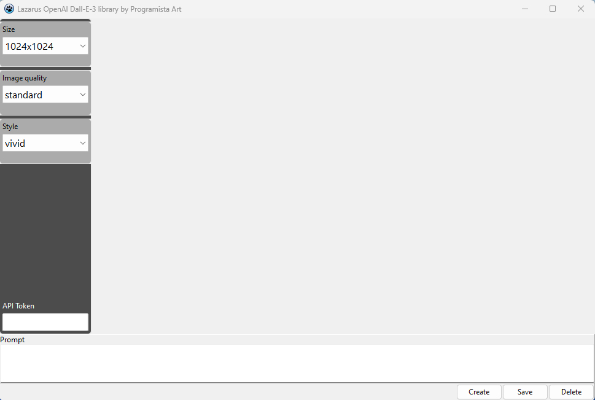

# Lazarus-OpenAI-Dall-E-3-library
Dall-E-3 Image Generation Library for Lazarus 3.4
# Demo program


# For the generation to work, you need to enter the Api Token
  ## Get API Token [link](https://platform.openai.com/docs/overview)
## The library is called imagegenerator.pas
# Required libraries
* libeay32.dll
* ssleay32.dll
## The code for the button that generates the photo
```pascal

procedure TDalee3.ButGenerateImgClick(Sender: TObject);
var
  ImageGenerator: TImageGenerator;
  Prompt: String;
  ImageThread: TImageGenerationThread;
  ApiToken: String;
begin
  ApiToken := EditToken.Text;
  Image1.Picture.Clear;
  Prompt := MemoPrompt.Text;
  if ApiToken = '' then
  begin
    ShowMessage('Enter API Token');
  end
  else
  begin
  //We create an image generator object with an API key
  ImageGenerator := TImageGenerator.Create(ApiToken);
  try
    //We take values from ComboBoxes and assign them to properties
    ImageGenerator.Size := ComboBoxSize.Items[ComboBoxSize.ItemIndex];
    ImageGenerator.Quality := ComboBoxQuality.Items[ComboBoxQuality.ItemIndex];
    ImageGenerator.Style := ComboBoxStyle.Items[ComboBoxStyle.ItemIndex];

    //We create and run a thread to generate images
    ImageThread := TImageGenerationThread.Create(ImageGenerator, Prompt, @ImageGenerationCompleted);
    ImageThread.Start;

    //User notification about generation start
    LabelInfo.Caption := 'Generating image. Please wait... ';
    //Buttons
    ButGenerateImg.Enabled := False;
    ButDeleteImg.Enabled := False;
    Buttsave.Enabled := False;
  except
    ImageGenerator.Free;
    raise;
  end;
  end;
end;
```
# Example generations


